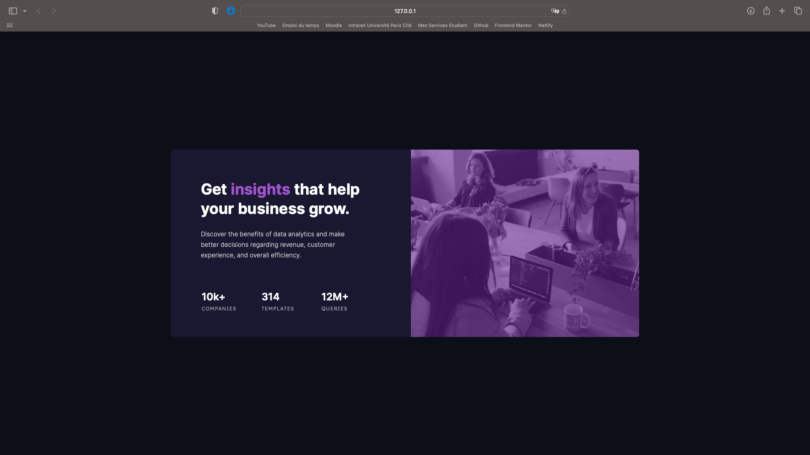

# Frontend Mentor - Stats preview card component solution

This is a solution to the [Stats preview card component challenge on Frontend Mentor](https://www.frontendmentor.io/challenges/stats-preview-card-component-8JqbgoU62). Frontend Mentor challenges help you improve your coding skills by building realistic projects. 

## Table of contents

- [Overview](#overview)
  - [The challenge](#the-challenge)
  - [Screenshot](#screenshot)
  - [Links](#links)
- [My process](#my-process)
  - [Built with](#built-with)
  - [What I learned](#what-i-learned)
  - [Continued development](#continued-development)
  - [Useful resources](#useful-resources)
- [Author](#author)

## Overview

### The challenge

Users should be able to:

- View the optimal layout depending on their device's screen size

### Screenshot



### Links

- Live Site URL: https://graceful-heliotrope-a34d6a.netlify.app

## My process

### Built with

- Semantic HTML5 markup
- CSS custom properties
- Flexbox

### What I learned

I learn how to put a filter on a image and i try to make my website perfect with accessibility by using landmarks. I learned how to use rem, em and why i should use that than pixel. I also learn how to use css in a better way.

```html
  <section class="stats">
    <h2 class="numbersStats">10k+</h2>
    <p class="statsDesc">companies</p>
  </section>

  <section class="imageSection">
    <div></div>
  </section>
```
```css
.titleArticle{
    color: hsl(0, 0%, 100%);
    font-family: 'Inter';
    font-weight: 700;
    font-size: 2.23rem;
    line-height: 1.3em;
}

.accent{
    color: hsl(277, 64%, 61%);
    font-family: 'Inter';
    font-weight: 700;
    font-size: 1em;
}

/* Images */
.imageSection{
    flex: 1;
    background-color: hsl(277, 65%, 38%);
    border-top-right-radius: 7px;
    border-bottom-right-radius: 7px;
    overflow: hidden;
}

.imageSection div{
    background-image: url(images/image-header-desktop.jpg);
    background-size: cover;
    width: 100%;
    height: 100%;
    opacity: 40%;
}
```

### Continued development

Use this section to outline areas that you want to continue focusing on in future projects. These could be concepts you're still not completely comfortable with or techniques you found useful that you want to refine and perfect.

### Useful resources

- [Pierre Giraud](https://www.pierre-giraud.com/html-css-apprendre-coder-cours/) - The website's in french but you can also learn how to use JavaScript. This is with that than i learn how to use HTML and CSS to make websites.

## Author

- Github - [Isekku](https://github.com/Isekku)
- Frontend Mentor - [@Isekku](https://www.frontendmentor.io/profile/Isekku)
- Twitter - [@kesusama](https://www.twitter.com/kesusama)
